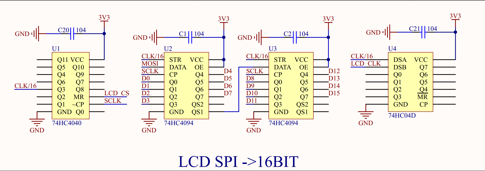
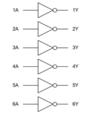

# RP2040 PIO Test for 3.5 inc RPI LCD module

It use series of 74HCXX chips to convert SPI to I8080 16bit, check the datasheet below here.

[https://www.waveshare.net/w/upload/8/85/Pico-ResTouch-LCD-3.5_Sch.pdf](https://www.waveshare.net/w/upload/8/85/Pico-ResTouch-LCD-3.5_Sch.pdf)

What needs to be done is to toggle the CS pin for each 16-bit SPI write.

The manual states that the maximum speed of the SPI clock is 32MHz, but after several attempts, it only runs stably at 30MHz.

## 74HC4040

It's a 12-Bit Asynchronous Binary Counters. In this case, It is used to reduce the clk frequency of spi by 16 times. a `MR` pulse will clear all outputs to L. data will be sampled at the falling edge of `SCLK`.

16 * `SCLK` => 2^4, Q3 will going to H. The `CS` signal will reset the counter. So if the input 'SCLK' at 125MHz, the output `Q3` will be at 7.8MHz.

## 74HC4094

8-bit shift register with latch signal. Two of these chips make up the 8080's 16-bit data bus. When 16 times `SCLK` is set, a `CLK/16` signal will activate and data will latch onto the data bus.

## 74HC04D

6-bit inverter. look the digram below.

Well. The I8080 bus's `WR` signal is active high and sampled at the falling edge.